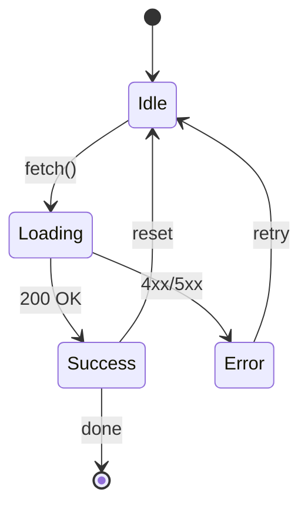

This note is a living reference for every element you can place in a `.mdx` note. Features come from: standard CommonMark, GitHub Flavored Markdown (GFM), KaTeX (math), Expressive Code (code blocks), and the site's custom plugins (highlights, callouts, image sizing, mermaid).

---

# Headings

## Heading 2 — H2
### Heading 3 — H3
#### Heading 4 — H4
##### Heading 5 — H5
###### Heading 6 — H6

---

# Text

Plain paragraph text is the baseline. **Bold** — `**text**` *Italic* — `*text*` ~~Strikethrough~~ — `~~text~~` ==Highlight== — `==text==` (custom plugin) <u>Underline</u> — `<u>text</u>` (HTML element) <s>Strike via HTML</s> — `<s>text</s>` <sub>subscript</sub> and <sup>superscript</sup> — `<sub>` / `<sup>`. <u>Underline with **bold** and *italic* and ==highlight== nested</u>. `Inline code` — backtick (not styled by text modifiers). <kbd>Ctrl</kbd>+<kbd>Shift</kbd>+<kbd>P</kbd> — keyboard keys via `<kbd>`. <abbr title="HyperText Markup Language">HTML</abbr> — abbreviation with tooltip via `<abbr title="...">`. Markdown internal link: [Rust](../rust/) — `[text](relative-path)`. External link: [Astro docs](https://docs.astro.build) — `[text](url)`. Bare URL (use a markdown link): [https://example.com](https://example.com) — `[url](url)`. Named footnote reference: see footnote[^named] for details. Internal anchor link: [Jump to Tables](#tables) — `[text](#heading-id)` navigates to any heading on the same page.

> A simple blockquote. Good for citations or callouts without icons.

> Nested blockquotes:
>
> > First level of nesting.
> >
> > > Second level of nesting.

---

# Lists

- This is a List
- Create with dash, asterisk or plus sign.
    - Nested B1
    - Nested B2
        - Deeply nested B2a
        - Deeply nested B2b
- Item C

1. First item
2. Second item
    1. Sub-item 2a
    2. Sub-item 2b
        1. Deep sub-item
3. Third item

- [x] Completed task
- [ ] Incomplete task
- [x] Another completed task
    - [x] Completed subtask
    - [ ] Incomplete subtask
- [ ] **Task with bold text**

1. Ordered item one
    - Unordered nested under ordered
    - Another unordered
        1. Ordered under unordered
2. Ordered item two
    - [ ] Task nested under ordered
    - [x] Completed task nested under ordered
        - Deeper unordered under task

---

# Code Blocks

Use `const x = 1` for variable declarations. Press <kbd>Ctrl</kbd>+`` ` `` to open the terminal.

```ts
// Default, line numbers and no title
function greet(name: string): string {
  return `Hello, ${name}!`;
}
```

```ts title="utils.ts"
// Default with title
export function clamp(val: number, min: number, max: number): number {
  return Math.min(Math.max(val, min), max);
}
```

```shell title:"Run dev server"
# Terminal with no line numbers
npm install
npm run dev
```

```ts title="highlight.ts" {1,4-6}
// line highlighting
const API_URL = "https://api.example.com";  // line 1 highlighted

function fetchData(endpoint: string) {
  const url = `${API_URL}/${endpoint}`;     // line 4 highlighted
  return fetch(url).then(r => r.json());    // line 5 highlighted
}                                            // line 6 highlighted
```

```ts title="refactor.ts" del={[2,3,4]} ins={[5,6,7]}
// Diff markers — EC syntax: del={[lines]} ins={[lines]} in the fence
function oldImplementation(x: number) {
  return x * x * x;
}
function cube(x: number): number {
  return x ** 3;
}
```

```diff
--- a/src/config.ts
+++ b/src/config.ts
@@ -2,5 +2,6 @@
 export const config = {
   host: "localhost",
-  port: 3000,
+  port: 8080,
+  debug: true,
 };
```

```ts title="rename.ts" del="OldService" ins="DataService"
class OldService {
  fetch() { return new OldService().run(); }
}
const svc = new DataService();
```

```ts title="word-highlight.ts" mark="active"
// mark="active" — highlights every occurrence of the word 'active' inline
const results = items.filter(item => item.active && item.score > 0.5);
if (results.filter(r => r.active).length > 0) return true;
```

```ts showLineNumbers=false
// Force no line numbers (showLineNumbers=false)
const x = 1;
const y = 2;
```

```ts title="long-line.ts" wrap
// Wrap long lines (wrap)
const veryLongVariableName = someObject.someMethod().chainedMethod().anotherChainedMethod().finalMethod("with a very long argument string");
```

```ts title="no-frame.ts" frame="none"
// frame="none" — the title tab above is suppressed; compare with "utils.ts" block above
const x = 1;
```

Code blocks can break out of the content column via wrapper divs — same classes as images:

<div class="wide">

```ts title="wide-code.ts"
// Wide column — same extra margin as wide images
export function process(items: Item[], config: ProcessConfig): ProcessResult {
  return items.filter(i => i.active).map(i => transform(i, config));
}
```

</div>

<div class="bleed">

```ts title="bleed-code.ts"
// Bleed — full width with a small edge gutter; between wide and full
export function process(items: Item[], config: ProcessConfig): ProcessResult {
  return items.filter(i => i.active).map(i => transform(i, config));
}
```

</div>

<div class="full" style="padding-inline: var(--size-4);">

```ts title="full-code.ts"
// Full page width — edge to edge (padding applied inline via style to prevent clipping)
export function process(items: Item[], config: ProcessConfig): ProcessResult {
  return items.filter(i => i.active).map(i => transform(i, config));
}
```

</div>

---

# Images

Images use the `` syntax. Modifiers after `|` are space-separated and combinable — e.g. `|400 center`. Below: default, 400px, centered at 450px, wide, bleed (between wide and full), full, and a captioned figure via HTML:


<figure style="text-align:center; margin-block: var(--size-5);">
  
  <figcaption style="color:var(--ink-soft); font-size:0.9em; margin-top:0.5em;">
    Douglas Engelbart — inventor of the computer mouse (1968)
  </figcaption>
</figure>

---

# Tables

| Column A | Column B | Column C |
| -------- | -------- | -------- |
| Row 1A   | Row 1B   | Row 1C   |
| Row 2A   | Row 2B   | Row 2C   |

Alignment

| Left-aligned | Center-aligned | Right-aligned |
| :----------- | :------------: | ------------: |
| Apple        |    Cherry      |        Banana |
| `code`       |  **bold**      |        *ital* |
| 123          |      456       |           789 |

Wide column table

<div class="wide">

| ID | Name | Role | Department | Start Date | Status | Notes |
| -- | ---- | ---- | ---------- | ---------- | ------ | ----- |
| 1  | Alice Smith | Senior Engineer | Platform | 2020-03-01 | Active | Team lead |
| 2  | Bob Jones | Designer | UX | 2021-07-15 | Active | Part-time |
| 3  | Carol White | Product Manager | Core | 2019-01-10 | On Leave | Returns Q3 |
| 4  | David Brown | QA Engineer | Platform | 2022-11-01 | Active | Night shift |

</div>

Bleed column table

<div class="bleed">

| ID | Name | Role | Department | Start Date | Status | Notes |
| -- | ---- | ---- | ---------- | ---------- | ------ | ----- |
| 1  | Alice Smith | Senior Engineer | Platform | 2020-03-01 | Active | Team lead |
| 2  | Bob Jones | Designer | UX | 2021-07-15 | Active | Part-time |
| 3  | Carol White | Product Manager | Core | 2019-01-10 | On Leave | Returns Q3 |
| 4  | David Brown | QA Engineer | Platform | 2022-11-01 | Active | Night shift |

</div>

Full wide table

<div class="full" style="padding-inline: var(--size-4); overflow-x: auto;">

| Short | Medium Length Column | Very Long Column That Stresses Table Layout And Tests Horizontal Scrolling Behaviour In Narrow Containers |
| ----- | -------------------- | ------------------------------------------------------------------------------------------------------- |
| A     | Lorem ipsum dolor sit amet | This is an extremely long string meant to push the layout limits of any table container, including nested divs, CSS flexboxes, and responsive designs. |
| B     | Consectetur adipiscing | A very long paragraph that repeats: Lorem ipsum dolor sit amet. Lorem ipsum dolor sit amet. |
| C     | Short                | Supercalifragilisticexpialidocious — a very long single word testing overflow handling. |

</div>

---

# Math

The area of a circle is $A = \pi r^2$. Einstein's famous equation is $E = mc^2$. Euler's identity: $e^{i\pi} + 1 = 0$

The quadratic formula:

$$
x = \frac{-b \pm \sqrt{b^2 - 4ac}}{2a}
$$

Matrix determinant:

$$
\begin{vmatrix} a & b \\ c & d \end{vmatrix} = ad - bc
$$

Maxwell's equations (differential form):

$$
\nabla \cdot \mathbf{E} = \frac{\rho}{\varepsilon_0}, \quad
\nabla \cdot \mathbf{B} = 0, \quad
\nabla \times \mathbf{E} = -\frac{\partial \mathbf{B}}{\partial t}, \quad
\nabla \times \mathbf{B} = \mu_0 \mathbf{J} + \mu_0\varepsilon_0\frac{\partial \mathbf{E}}{\partial t}
$$

Fourier transform:

$$
\hat{f}(\xi) = \int_{-\infty}^{\infty} f(x)\, e^{-2\pi i x \xi}\, dx
$$

Multi-line aligned equations with `\begin{align}`:

$$
\begin{align}
  \sin^2\theta + \cos^2\theta &= 1 \\
  e^{i\theta}                 &= \cos\theta + i\sin\theta \\
  \cosh^2 x - \sinh^2 x       &= 1
\end{align}
$$

---

# Graphs (Mermaid)

Mermaid renders client-side from CDN and re-renders on theme toggle.



---

# Callouts

All callout types from `> [!type]` syntax. Unsupported types default to `note`.

> [!note] Note
> General information that is worth drawing attention to.

> [!info] Info
> Contextual information for the reader.

> [!abstract] Abstract / Summary / TLDR
> A quick summary of a longer document or section.

> [!todo] Todo
> Tasks or action items that need to be done.

> [!tip] Tip / Hint / Important
> A helpful tip or important note.

> [!success] Success / Check / Done
> Indicates success or completion.

> [!question] Question / Help / FAQ
> Questions or FAQs.

> [!warning] Warning / Caution / Attention
> Something that could cause problems.

> [!failure] Failure / Fail / Missing
> Indicates failure or something missing.

> [!danger] Danger / Error
> Critical danger or a serious error.

> [!bug] Bug
> A known bug or issue.

> [!example] Example
> An example or demonstration.

> [!quote] Quote / Cite
> A quotation or citation.

> [!tip]+ Foldable tip, open by default
> Click to collapse The `+` start expanded.
>
> You can put any content here: lists, code, tables, nested callouts.

> [!warning]- Foldable warning, collapsed by default
> This content is hidden until expand it. The `-` start collapsed.

> [!example]- Click to see a code example
> ```ts title="example.ts"
> function add(a: number, b: number): number {
>   return a + b;
> }
> ```

> [!question] Can callouts be nested?
> > [!tip] Yes, they can!
> > > [!example] Even three levels deep.
> > > Use nesting sparingly — two levels is usually enough.

> [!note] Callout with various content
> Normal paragraph inside a callout.
>
> - Bullet list inside callout
> - Another item
>     - Nested item
>
> 1. Ordered list inside callout
> 2. Another ordered item
>
> Inline `code` and **bold** and *italic* all work inside callouts.
>
> Math too: $E = mc^2$

<details>
<summary>Click to expand native HTML details element</summary>

This content is hidden by default. Unlike callouts, this uses the browser's built-in `<details>/<summary>` elements.

You can put any content here, including **bold**, *italic*, lists, and even code:

```ts
const secret = "hidden until expanded";
```

</details>

Inline MDX comment: {/* this comment is invisible in the rendered output */}

<div class="wide" style="background:color-mix(in oklab, var(--bg), var(--ink) 4%); padding:var(--size-4); border-radius:var(--radius-2); border:1px solid var(--tile-border);">

This content is in a `<div class="wide">` with custom CSS inline styles. It breaks out into the wide layout column and has a subtle background that matches the site's design tokens.

</div>

---

# Footnotes

Named footnotes are defined anywhere in the document and rendered at the bottom.[^ref1] Here I'm inserting two references. [^ref2]

[^ref1]: This is the first named footnote. It can contain **bold**, *italic*, and `inline code`.

[^ref2]: This is the second footnote.
    Continuation lines indented with 4 spaces are part of the same footnote.
    You can even have multiple paragraphs.

    Second paragraph of the footnote.

---

# Code Colors

```c title="token_showcase.c"
/* block comment */
// line comment

#include <stdio.h>

#define PI            3.14159265358979
#define CONCAT(a, b)  a##b
#define CLAMP(v,lo,hi) (((v)<(lo))?(lo):(((v)>(hi))?(hi):(v)))

typedef enum {
    STATUS_IDLE = 0,
} Status;

typedef struct Node {
    const char *label;
} Node;

static inline int32_t clamp_i32(int32_t val, int32_t lo, int32_t hi);
void                  arena_free(Arena *a);

static inline int32_t clamp_i32(int32_t val, int32_t lo) {
    return val < lo ? lo : (val > hi ? hi : val);
}

int main(int argc, char *argv[]) {
    int          decimal  = 42;
    unsigned int udecimal = 42u;
    int          hex      = 0xDEADBEEF;
    const char  *greeting = "Hello, World!\n";
    head->id    = 42;
    int node_id = stack_node.id;
    printf(fmt, arith, pi_d);
    fprintf(stderr, "argc = %d\n", argc);
    size_t sz_node = sizeof(Node);
    int final = CLAMP(
        (int)((double)arith * PI + (float)shift / (decimal + 1.0f)),
        -(MAX_ITEMS),
        MAX_ITEMS
    );
}
```

```ts title="ts-tokens.ts"
const msg = `Hello ${name}, score: ${score.toFixed(2)}`;
const raw = "plain string literal";

const re   = /^[a-z_]\w*$/i;
const ok   = true;
const none = null;

class Counter {
  count = 0;
  inc() { this.count++; }
}

import { readFile } from 'fs/promises';
export default Counter;

function log(target: any, key: string) {}
class Service {
  @log name = "svc";
}
```

```tsx title="jsx-tokens.tsx"
const el = (
  <div className="wrapper" id="root">
    <MyComponent title="hello" disabled={false} />
    <input type="text" placeholder="…" />
  </div>
);
```

---
