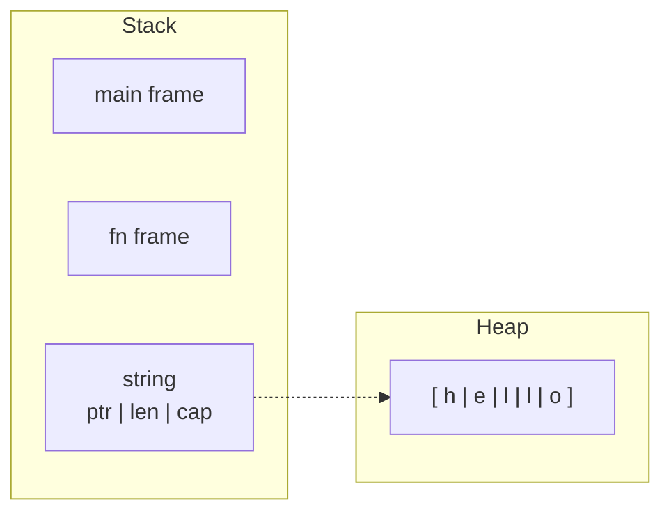
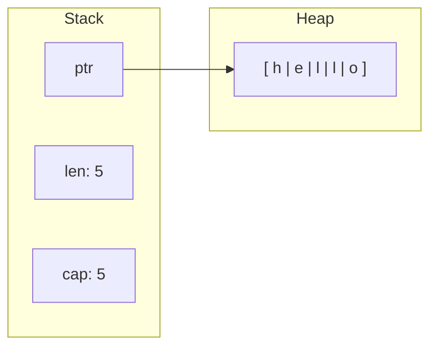
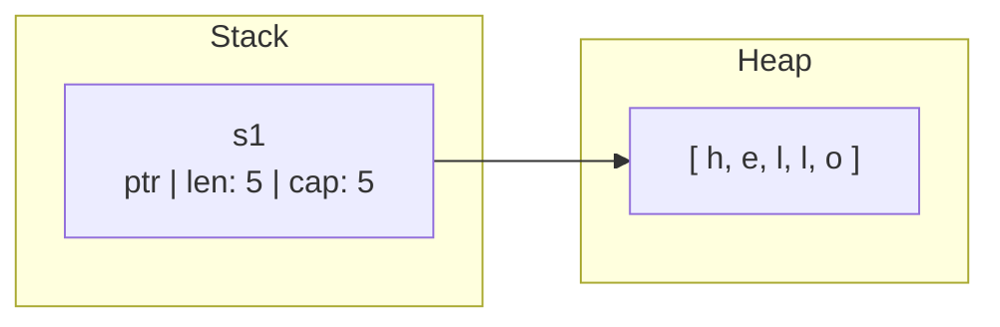
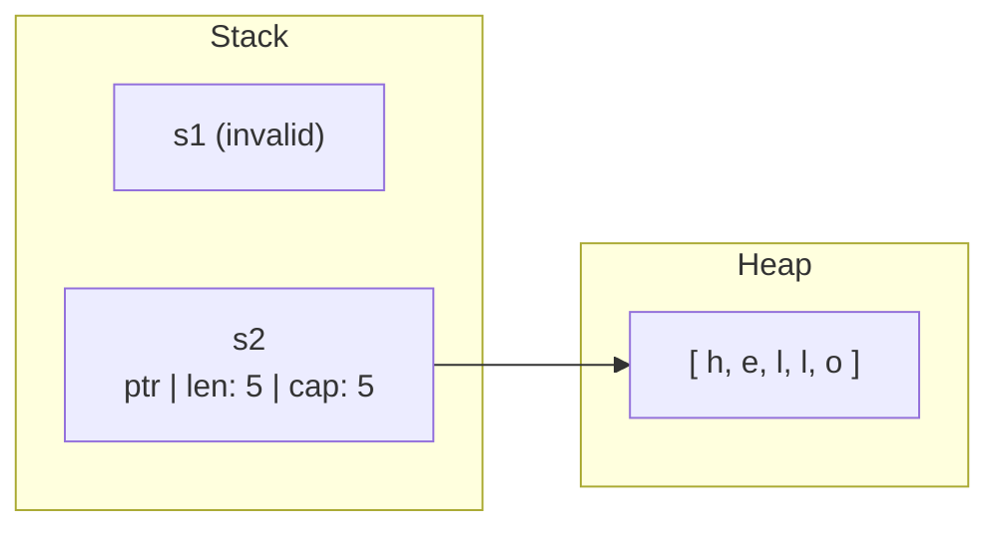
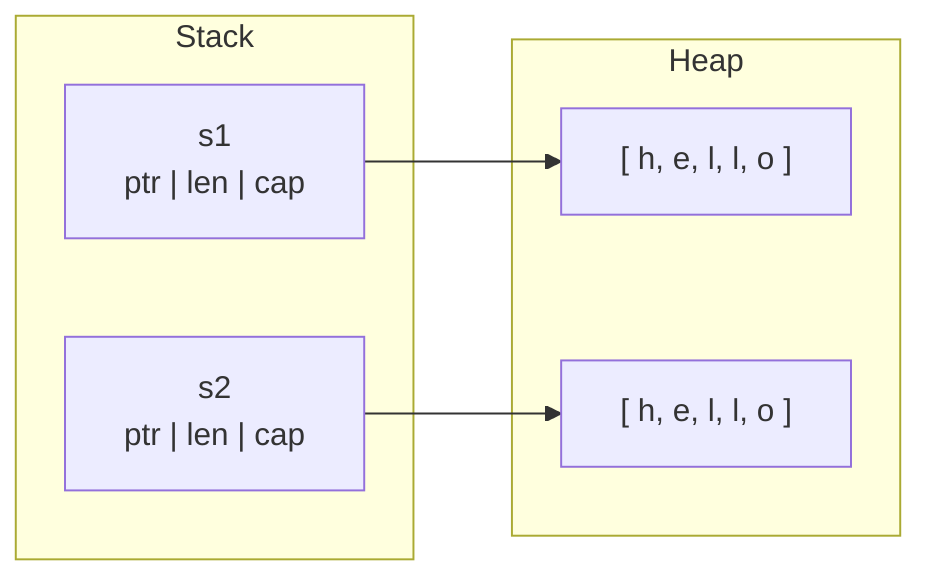
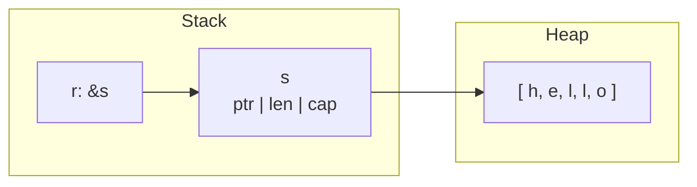
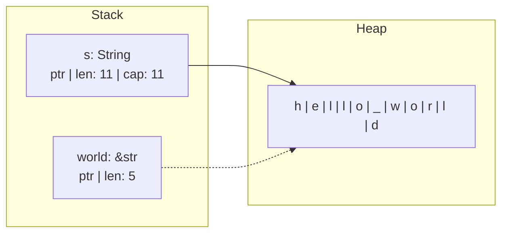
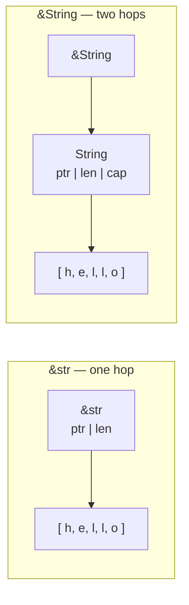
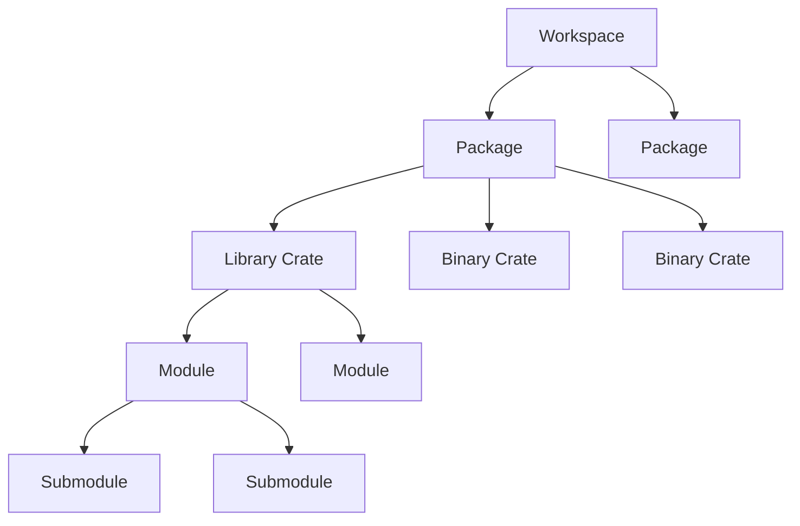
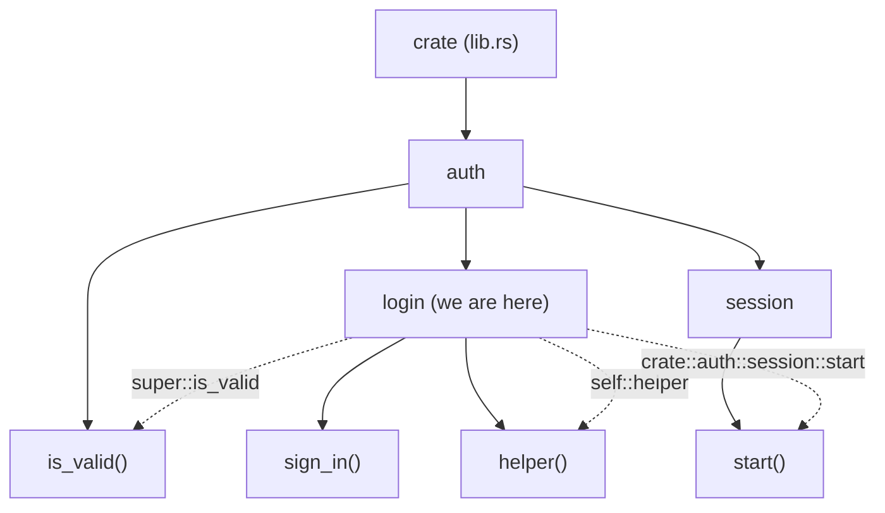

# Start

## Install

For Windows go to [Rust install page](https://rust-lang.org/tools/install/) and download the installer. For Unix systems install by downloading the `rustup` utility:

```shell title:"Install Rust"
curl --proto '=https' --tlsv1.2 -sSf https://sh.rustup.rs | sh
```

This will install rust in `$HOME/.cargo/bin` or `%USERPROFILE%\.cargo\bin`. 

> [!Tip]- Uninstall, update or validate the installation
> ```shell
> # Uninstall Rust
> rustup self uninstall
> 
> # Update Rust
> rustup update
> 
> # Validate installation
> rustc --version
> cargo --version
> rustdoc --version
> ```

## Toolchain

The installation tool `rustup` installs itself and three core tools: `rustc`, `rustdoc` and `cargo`. Rust is designed to be built and executed using `cargo` (it wraps the other two).

### rustc

The compiler, it takes `.rs` files and produces native executables.

> [!Example]- Using rustc directly
> ```rust title:"main.rs"
> fn main(){
> 	println! ("Hello World");
> }
> ```
> ```shell title:"Compile Rust"
> rustc main.rs
> ./main
> ```

### rustdoc

The HTML documentation generator from doc comments (`///` for items and `//!` for modules/crates) into `./doc/` directory.

```shell title:"Generate docs"
rustdoc src/lib.rs
```

> [!Example]- Using rustdoc directly
> ```rust title:"lib.rs"
> /// Adds two numbers and returns the result.
> ///
> /// Returns `a + b` as an `i32`.
> pub fn add(a: i32, b: i32) -> i32 {
> 	a + b
> }
> ```
>```shell title:"Generate docs"
>rustdoc src/lib.rs
>```

### cargo

Build system and package manager. Used to create projects, resolve dependencies, compile and execute Rust.

#### new

Create a new cargo project.

```shell title:"New project"
cargo new my_project   # To create a binary project (default)
cargo new my_lib --lib # To create a library project
```

> [!Tip]- Project structure generated by `cargo new`
> ```
> my_project/
> ├── Cargo.toml      # Manifest: name, version, dependencies
> ├── cargo.lock      # Locked dependency versions for build
> ├── src/
> │   └── main.rs     # Entry point (lib.rs for libraries)
> └── target/         # Build artifacts (generated on build)
> ```

#### check

Check if the project code will compile.

```shell title:"Check project code"
cargo check
```

#### build

Compile a project with all its dependencies. (invokes `rustc` with flags)

```shell title:"Build"
cargo build                # Debug build  → target/debug/
cargo build --release      # Optimized    → target/release/
```

Resolves `Cargo.toml` crates and updates the `Cargo.lock` file, then invokes `rustc` with a set of flags placing the output in `target/<profile>`.

> [!Tip]- Build profiles
> 
> Cargo has four built-in profiles, each configurable in `Cargo.toml` under `[profile.<name>]`:
>
> | Profile   | Triggered by            | Optimization | Debug info |
> |-----------|-------------------------|--------------|------------|
> | `dev`     | `cargo build`           | None         | Yes (rust-gdb, rust-lldb, debug_assert)       |
> | `test`    | `cargo build --profile test`            | None         | Yes, plus include test attributes       |
> | `release` | `cargo build --release` | Full (opt-level=3)        | No         |
> | `bench`   | `cargo build --profile bench`           | Full (opt-level=3)        | No, but include bench attributes         |
> 

#### run

Build and then execute the resulting binary (invokes `rustc` with flags and executes).

```shell title:"Run"
cargo run            # Build + run (default dev build profile)
```

> [!Tip]- Run with other build profiles
> 
> ```shell title:"Run with release, test and bench profiles"
> cargo run --release        # Build + run (release profile)
> cargo test                 # Build + run with test profile (runs all tests)
> cargo bench                # Build + run with bench profile (runs all benchmarks)
> ```
> Test and bench execute the functions with `#[test]` and `#[bench]` attributes
> 

#### doc

Create the HTML documentation (invokes `rustdoc`).

```shell title:"Generate docs"
cargo doc --open           # Build docs and open in browser
cargo doc --no-deps        # Only generate your crate docs, skip dependencies
```

### crates

Dependencies are defined in `Cargo.toml` and fetched from [crates.io](https://crates.io). 

```shell title:"Add, update, remove dependency"
cargo install dependency_name        # Install crate globally into ~/.cargo/bin
cargo install --list                 # Display globally installed crates
cargo uninstall dependency_name      # Uninstall crate globally
cargo add dependency_name            # Fetch and add latest version to project
cargo update -p dependency_name      # Update crate to latest compatible ver
cargo remove dependency_name         # Remove crate from project
```

> [!Tip]- Commonly used dependency commands
> ```shell
> cargo update                                 # Update all dependencies within semver constraints
> cargo clean                                  # Remove all build artifacts and dependency builds
> cargo add dependency_name@1.0                # Add specific crate version
> cargo add dependency_name --features derive  # Add with feature flags
> cargo add --dev dependency_name              # Add crate as a dev dependency
> cargo add --build dependency_name
> cargo tree                                   # Full dependency tree with versions
> cargo tree -i dependency_name                # Reverse: who pulls in dependency_name?
> cargo tree --duplicates                      # Find multiple versions of the same crate
> cargo search dependency_name                 # Search for specific crate
> cargo outdated                               # Check for outdated crates (requires cargo-outdated)
> cargo audit                                  # Audit crates against CVEs (requires cargo-audit)
> ```

## Cargo.toml

The manifest declares package metadata, dependencies, targets, features and build configuration. 

### Metadata 

The mimimum required fields are `name`, `version` and `edition`:

```toml title:"Cargo.toml"
[package]
name = "my_project"
version = "0.1.0"
edition = "2024"
```

> [!Tip]- Common metadata fields
> ```toml
> [package]
> name         = "my_project"                   # crates.io name (required, must be unique)
> version      = "0.1.0"                        # semver (required)
> edition      = "2024"                         # Rust edition: 2015, 2018, 2021, 2024
> authors      = ["Name <me@example.com>"]      # Author name and email
> description  = "A short blurb"                # Required for publishing to crates.io
> license      = "MIT"                          # SPDX expression
> repository   = "https://github.com/user/repo" # Git repository
> readme       = "README.md"                    # Readme file
> keywords     = ["cli", "parser"]              # Max 5, for crates.io search
> categories   = ["command-line-utilities"]     # creates.io package category
> rust-version = "1.75"                         # Minimum Supported Rust Version (MSRV)
> ```

### Dependencies

Dependencies must have a context and a semver requirement. They can be fetched from crates.io, a git repo or a local path. They can have specific feature flags enabled.

#### Context

1. `[dependencies]` is what `src/` imports. Ships in the final binary or library. e.g. serde, tokio, clap, anyhow.
2. `[dev-dependencies]` is what `tests/`, `benches/`, `examples/`, and `#[cfg(test)]` blocks use. Stripped from the published crate. e.g. criterion, proptest, mockall, assert_cmd.
3. `[build-dependencies]` is what `build.rs` uses to do code generation, native compilation, or linker setup before your crate is built. Never touched by `src/`. e.g. cc, bindgen, prost-build.

```toml
[dependencies]            # Used by src and release artifacts.
dependency_name = "1.0" 
[dev-dependencies]        # Used only by src for test, bench and example artifacts. 
dependency_name = "1.0"  
[build-dependencies]      # Not used by artifacts, used by buils.rs at compile time.
dependency_name = "1.0"
```

#### Semver

All dependencies require a semver requirement string. Cargo updates dependencies only within the range specified by the semver string, by default jumps between major versions `1.x -> 2.x` have to be added explicitly with `cargo add`. 

```toml
# Plain semver string are implicitly caret-prefixed
dep_name = "0"                    # >=0.0.0, <1.0.0
dep_name = "1"                    # >=1.0.0, <2.0.0
dep_name = "~1"                   # >=1.0.0, <2.0.0
dep_name = "1.*"                  # >=1.0.0, <2.0.0
dep_name = "1.2"                  # >=1.2.0, <2.0.0
dep_name = "1.2.3"                # >=1.2.3, <2.0.0
# For 0.x minor instead of major bumb is breaking 
dep_name = "0.0"                  # >=0.0.0, <0.1.0
dep_name = "0.5"                  # >=0.5.0, <0.6.0
dep_name = "0.5.3"                # >=0.5.3, <0.6.0
dep_name = "~1.2"                 # >=1.2.0, <1.3.0
dep_name = "1.2.*"                # >=1.2.0, <1.3.0
# For 0.0.x patch instead of minor bumb is breaking
dep_name = "0.0.0"                # >=0.0.0, <0.0.1
dep_name = "0.0.5"                # >=0.0.5, <0.0.6
dep_name = "~1.2.3"               # >=1.2.3, <1.2.4
# Wildcards are best avoided 
dep_name = "*"                    # Any version - blocked by crates.io 
# Comparisons are more loose
dep_name = ">=1.2.3"              # At least 1.2.3, no upper bound
dep_name = ">1.2.3"               # Greater than 1.2.3, no upper bound 
dep_name = "<1.2.3"               # Less than 1.2.3, no lower bound
dep_name = "<=1.2.3"              # At most 1.2.3, no lower bound 
dep_name = "=1.2.3"               # Exactly 1.2.3, disables updates
dep_name = ">=1.2, <1.5"          # 1.2.0 to 1.4.x
dep_name = ">1.0, <=1.4.5"        # 0.x.x to 1.4.5
# Pre-releases are outside the normal range, this means that "<1"
# does not include 0.0.1-beta even though technically it is lower
dep_name = "1.0.0-beta.2"         # Opt into 1.0.0-beta line 
dep_name = ">=1.0.0-alpha"        # Opt into 1.0.0 pre-releases and stable forward 
# Inline table explicit form
# This notation is used to add features, optional, path, git and other options
dep_name = { version = "1", features = ["full"], optional=true }
```

#### Source

We can specify the source from which we fetch the crates.

```toml
[dependencies]
dep_name = "1"                                                                        # Fetched from crates.io (default)
dep_name = { version = "1", path = "../my_utils"}                                     # Fetched from local path
dep_name = { version = "1", git = "https://github.com/usr/repo", branch = "main"}     # Fetched from git repo branch 
dep_name = { version = "1", git = "https://github.com/usr/repo", rev = "abc123"}      # Fetched from git repo commit 
dep_name = { version = "1", optional = true}                                          # Fetched async only when enabled by a feature
```

#### Feature

Feature are opt-in compile flags that toggle extra code paths or pull optional dependencies. 

```toml
[dependencies]
json_dependency = { version = "1", optional = true }
async_dependency = { version = "1", optional = true }
[features]
default = ["json"]                 # Always enabled (unless --no-default-features is set)
json = ["dep:json_dependency"]     # If json is enabled it pulls json_dependency
async = ["dep:async_dependency"]   # If async is enabled it pulls async_dependency
full = ["json, async"]             # If full is enabled it enables json and async 
```

```shell
cargo build --no-default-features
cargo build --features async 
cargo build --features json
cargo build --features full
cargo build --all-features
```

#### Profile

You can override one of the compiler build profiles or create a custom one. This is mainly used to fine tune the release artifacts build process.

```toml
[profile.release]
opt-level = 3      # 0 to 3 levels of optimization 
lto = "fat"        # Link-time optimizations - off, thin, fat
codegen-units = 1  # Lower equals better optimizations and slower compile
strip = "symbols"  # Strip debug symbols
panic = "abort"    # Smaller binary with no unwinding
```

#### Target

The target is auto-detected by cargo but you can declare it explicitly. Note the double brackets since `toml` will treat it as an array of tables (a crate can produce multiple artifacts).

```toml
[[bin]]
name = "cli"              # Build as cli artifact from cli.rs 
path = "src/bin/cli.rs"
[[example]]               # Build demo from examples/demo.rs 
name = "demo"
[[bench]]                 # Build bench from benches/perf.rs
name = "perf"
harness = false           # Also disable, nightly built-in bench harness
```

#### Workspace

Some projects contain multiple crates, in this case the root `cargo.toml` can act as a workspace root file so that all members share a single `cargo.lock` file and `target/` directory. This improves build speeds and the project structure.

```toml
[workspace]
members  = ["app", "core", "utils"]
resolver = "2"                                       # Default in edition 2021+
[workspace.dependencies]                             # Shared dependencies, defined once
serde = "1.0"
tokio = { version = "1.0", features = ["full"] }
```

Then each member crate just inherits:

```toml title:"app/Cargo.toml"
[dependencies]
serde = { workspace = true, features = ["derive"] }
tokio = { workspace = true }
```

# Fundamentals

## Variables

Variables are named storage locations that map a symbolic name to a value in memory, the name is replaced with the memory location at compile time. Declared with **let**, immutable by default; opt into mutability with **mut**.

```rust title:"main.rs - variables"
fn main(){
  let x = 2;
	println! ("x = {}", x);
  let mut y = 2;
  y = 3;
  println! ("y = {}", y);
}
```

### Shadowing 

Rebinding a variable name with a new **let** shadows the previous binding. Unlike **mut**, shadowing creates a fresh binding and therefore can change the type.

```rust title:"main.rs - shadowing"
rustfn main() {
    let x = "5";                         // &str
    let x = x.parse::<i32>().unwrap();   // Shadowing the string into i32
    let x = x + 1;                       // i32, value = 6
    println!("x = {}", x);
}
```

### Constants 

Use `const` to declare a compile-time constant. Constants must be annotated, their values must be a constant expression and they conventionally use SCREAMING_SNAKE_CASE. They are *inlined* when used, meaning they don't necessarily have a fixed memory address.

```rust title:"main.rs - constants"
rustconst MAX_USERS: u32 = 100_000;
```

Use `static` to declare a value with a fixed memory address. They are usually used to define the global state of the program, creating a *mutable static* requires an unsafe memory access point.

```rust title:"main.rs - statics"
ruststatic APP_NAME: &str = "my-app";
```

## Data Types

Rust is statically typed, data types must be known at compile time. The type can be inferred or explicitly annotated with a colon. Variables can be declared without a value as long as they are annotated (however they must be initialized before being read).

```rust title:"Data Types"
fn main() {
  let _int: i32 = 42;
  println! ("Int = {}", _int);
  let _float: f64 = 3.141;
  let _boolean: bool = true;
  let _character: char = 'R';
  let _tuple: (i32, f64, char, bool) = (42, 3.141, 'R', true);
  let _unit_tuple: () = ();
  let _array: [i32; 5] = [1, 2, 3, 4, 5];
}
```

Data types can be broadly subdivided into **scalar** and **compound** data types.

### Integers

Signed go from $-(2^{n-1})$ to $2^{n-1}-1$. Unsigned go from $0$ to $2^n-1$. Signed are stored using two's complement representation. 

<div class="wide">

| Bit Width | Signed | Unsigned | Signed Range | Unsigned Range |
|-----------|--------|----------|--------------|----------------|
| 8 | `i8` | `u8` | −128 to 127 | 0 to 255 |
| 16 | `i16` | `u16` | −32,768 to 32,767 | 0 to 65,535 |
| 32 (default) | `i32` | `u32` | −2,147,483,648 to 2,147,483,647 | 0 to 4,294,967,295 |
| 64 | `i64` | `u64` | −(2^63) to 2^63 − 1 | 0 to 2^64 − 1 |
| 128 | `i128` | `u128` | −(2^127) to 2^127 − 1 | 0 to 2^128 − 1 |
| arch-dependent | `isize` | `usize` | matches pointer width (32 or 64 bit) | pointer width | 

</div>

The primary use for `isize/usize` is indexing collections. Literals accept `_` as a visual separator and type suffixes: Hex as `0xff`, octal as `0o77`, binary as `0b11110000` or byte as `b'A'` (u8 only). Dev and test artifacts include an overflow panic check, however release artifacts wrap overflows via two's complement. 


### Overflow

In debug (dev, test) normal arithmetic operators `+ - * /` will panic when overflown but silently wrap in release (releease, bench). If you expect overflow to happen you can explicitly handle it by calling an overflow method and the intended arithmetic operator (`_add`, `_sub`, `_mul`, `_div`, `_neg`, `_rem`, `_pow`, `_shl`, `_shr`, etc.).

```rust title:"main.rs"
fn main() {
    let max_u8 = u8::MAX;
    let wrapped = max_u8.wrapping_add(1);
    println!("Wrapped: {}", wrapped);  // Outputs Wrapped: 0
}
```

<div class="bleed">

| Method | Behavior | Return Type | Example: `u8::MAX.X_add(1)` | When to Use | Wrapper Notation |
|---|---|---|---|---|---|
| `wrapping_*` | Wraps around via two's complement (Default) | `T` (the wrapped value) | `0` | For cyclic operations, hashes, ring buffers, low-level bit manipulation, crypto. | `Wrapping(255u8) + Wrapping(1) = Wrapping(0)` |
| `checked_*` | Returns `None` if it would overflow; otherwise `Some(result)` | `Option<T>` | `None` | Overflow is an error condition that must be handled. For input validation or math. | `Checked(255u8) + Checked(1) = None` |
| `overflowing_*` | Returns the wrapped result including a flag indicating whether overflow occurred | `(T, bool)` | `(0, true)` | For bignum arithmetic, carry-chain logic, or cases where you want to continue. | `Overflowing(255u8) + Overflowing(1) = Overflowing(0, true)` |
| `saturating_*` | Clamps at the type's `MIN` or `MAX` instead of wrapping | `T` (clamped value) | `255` | For progress bars, audio volume, percentages, sensor readings | `Saturating(255u8) + Saturating(1) = Saturating(255u8)` |

</div>

### Scalar

<div class="bleed">

| Type | Annotation | Size | Range / Valid Values | Default | Signed? | Key Notes |
|------|-----------|------|---------------------|---------|---------|-----------|
| Integer | `i8`-`i128`,`u8`-`u128`,`isize`,`usize` | 1–16 bytes (arch `isize`/`usize`) | See integer table above | `i32` | `i`=yes, `u`=no | Two's complement. |
| Floating-point | `f32`, `f64` | 4 or 8 bytes | IEEE-754 single (≈7 decimal digits) / double (≈15–17 decimal digits) precision | `f64` | always signed | f64 is roughly the same speed as f32 on modern CPUs. |
| Boolean | `bool` | 1 byte | `true` or `false` | — | n/a | Used in conditionals and logic. |
| Character | `char` | 4 bytes | Unicode scalar: `U+0000`–`U+D7FF` and `U+E000`–`U+10FFFF` | — | n/a | Single quotes: `'A'`, `'🦀'`, `'\u\{2A\}'`. |

</div>

### Compound

<div class="bleed">

| Type | Syntax | Type Annotation | Length | Element Access | Element Types | Memory | Key Notes |
|------|--------|-----------------|--------|----------------|---------------|--------|-----------|
| Tuple | `(v1, v2, ...)` | `(T1, T2, ...)` | Fixed at declaration | Period + index: `tup.0` | Mixed types allowed | Stack | Empty `()` is the implicit return for no value expressions. Mutable ones can change values but not their type or size. |
| Array | `[v1, v2, ...]` or `[v; N]` (repeat) | `[T; N]` | Fixed at compile time | Brackets: `arr[0]` | All elements share one type | Stack (stored sequentially) | Rust panics in both compile and runtime if try to access an element out of bounds. Use `Vec<T>` for growable heap-allocated collection. |

</div>

### Casting 

Rust never coerces between types implicitly, type casting is usually done explicitly with `as`. This defaults to truncating or wrapping on narrowing conversions (e.g i32 -> i8). 

```rust title:"main.rs"
fn main() {
    let a: i32 = 5;
    let b: f64 = 2.5;
    let sum = a as f64 + b;    // 7.5
    println!("{}", sum);
}
```

For safe, fallible conversions use `TryFrom` and `TryInto`, for lossless conversions use `From` and `Into`.

## Comments

Single-line comments use double forward slash while multi-line comments use a comment block:

```rust title:"main.rs"
fn main() {
  // This is a single-line comment
  /* This is a multi-line
     comment
  */
}
```

## Functions

Functions organize code into reusable units. `main()` is the entry point of every Rust program. Declared with `fn`, followed by name, parameters with explicit types, optional return type, and a body. The convention is to use *snake_case* for the function name and parameters.

```rust title:"main.rs - functions"
fn function_name(arg1:type, arg2:type,...) -> ReturnType{
	// Body1
}
```

### Statement, Expression

A function's body consists of **statements** and or **expressions**. Statements perform an action and return a unit touple (meaning no value), they end with a `;`. Expressions evaluate to a value they return, they have no trailing `;`.

```rust title:"main.rs - statements and expressions"
fn main() {
    let x = 5;            // statement does not return a value (simply binds to 5)
    let y = { x + 1 };    // the expression (x+1) does evaluates to a value (6)
    println!("{}", y);
}
```

### Return Single

You can annotate a function's return type with `->` and return a value explicitly with `return` or implicitly by ending the function's body with an expression.

```rust title:"main.rs - return a value"
fn sum(x: i16, y: i16) -> i16 {
    x + y // no `;` so it implicitly returns this expression's value
}

fn abs(x: i32) -> i32 {
    if x < 0 { return -x; } // early explicit return
    x
}

fn main() {
    println!("{}", sum(2, 3));   // 5
    println!("{}", abs(-7));     // 7
}
```

### Return Multiple

To return multiple values at the same time we can use a tuple and then destructure it at the call site.

```rust title:"main.rs - return multiple values"
fn min_max(a: i32, b: i32) -> (i32, i32) {
    if a < b { (a, b) } else { (b, a) }
}

fn main() {
    let (lo, hi) = min_max(7, 3);
    println!("lo={}, hi={}", lo, hi);   // lo=3, hi=7
}
```

## Control Flow

Control flow tools allow us to execute code based on certain conditions or execute repeating code. 

### If - Else

We use `if` to conditionally execute code based on an explicit boolean condition (Rust does not coerce integers, options or similar into truthy-falsy). 

For mutually exclusive blocks we can use `if - else` expressions and for multiple non-overlapping conditions we can use `if - else if` expressions. `if` expression branches that implicitly return a value of the same data type can be assigned into a variable.

```rust title:"main.rs - conditionals"
fn main() {
	let a = 10;
	if a == 10 {
		println!("a is 10");
	} else {
		println!("a is not 10");
	}

  let grade = 67;
  let letter = if grade > 90 { 'A' }
                else if grade > 80 { 'B' }
                else if grade > 70 { 'C' }
                else if grade > 60 { 'D' }
                else { 'F' };
  println!("Grade: {}", letter);
}
```

### Match

`match` is an alternative to `if - else if` expression branches that compare a value against a pattern and return a value, `match` branches must be exhaustive meaning that they cover every possible value. The pattern can be a literal (0), an OR pipe pattern (1|2), a range (3..=9) or any (`_`).

```rust title:"main.rs - conditionals"
fn main() {
  let n = 3;
  let label = match n {
      0       => "zero",
      1 | 2   => "small",
      3..=9   => "medium",
      _       => "large",
  };
  println!("{}", label);
}
```

### Loops 

We can repeatidly execute a block of code with a `loop` (infinite), `while` (condition-driven) or a `for` (iterator-driven) loop method.

#### Loop

Runs until it encounters a `break`, else it runs indefinitely. You can pass a value to `break` in order to return it from the loop.

```rust title:"main.rs - loop"
fn main() {
  let mut a = 5;
  let final_a = loop {
    a -= 1;
    if a == 2 { break a; }
  };
  println!("Loop result = {}", final_a);  // 2
}
```

#### While 

Runs until a condition goes from `true` to `false`. 

```rust title:"main.rs - while"
fn main() {
  let mut b = 5;
  while b > 2 {
    b -= 1;
    println!("b = {}", b); // 5,4,3
  }
}
```

#### For 

Runs until it finishes iterating over the elements of a collection. A `for` loop can be considered a `while` loop with a counter but it is optimized for this use case.

```rust title:"main.rs - for"
fn main() {
  for i in 0..3   { println!("{}", i); }   // 0, 1, 2
  for i in 0..=3  { println!("{}", i); }   // 0, 1, 2, 3
  let values = [1, 2, 3, 4];
  for v in &values {
    println!("value = {}", v);   // 1,2,3,4
  }
}
```

#### Break, Continue, Labels

To exit the innermost loop use `break`. To skip the next iteration use `continue`. To target a specific loop within nested loops you can add a label to it `'loop_name:`.

```rust title:"break, continue, labels"
fn main() {
    'outer: for i in 0..5 {
        for j in 0..5 {
            if i * j > 6 { break 'outer; }
            println!("{}, {}", i, j); 
        }
    }
}
```

## Questions 

Does this compile? If not, why and how to correct?

```rust
fn main() {
  let a=2;
  let b=3.0;
  println!("Sum of a and b = {}", a+b);
}
```

> [!check]- Answer
> 
> No since `a` is inferred as `i32` and `b` as `f64`. Fix with an annotation `let a:f64=2.0;` or a cast `let sum=a as f64+b;`.

You have an array of 4 floats, implement find_mean() 

```rust
fn main() {
  let ar = [2.5, 3.0, 4.5, 2.0];
  println!("Mean of ar = {}", find_mean(ar));
}
```

> [!check]- Answer
> 
> ```rust 
> fn find_mean(ar: [f64; 4]) -> f64 {
>  let mut sum = 0.0;
>  for v in ar.iter() { sum += v; }
>  sum / ar.len() as f64
>}
>```

Write down the output of this program

```rust
fn main() {
  let mut a:i8 = 125;
  a = a+3;
  println!("a={}", a);
}
```

> [!check]- Answer
> 
> `i8` overflows so it depends on the build profile of the artifact. On debug it panics but on release it wraps via two's complement (-128).

State if true or false:

1. f32 is the default for floats = false, it is f64
2. Doing `let a = 5;` the data type of x is i8 = false, it is i32
3. Floats are compound data types = false, it is scalar
4. Statements do not produce a result = true, statements evaluate to ().
5. What is shadowing = rebinding an existing name, creates a fresh bind


# Ownership

## Principle

All programs need to manage memory, here are some common strategies:

- **Manual** (C/C++): the programmer allocates and frees explicitly. Fast but error-prone with leaks, double-frees, use-after-free.
- **Garbage collected** (Go, Java, Python): a runtime periodically scans for unreachable memory and frees it. Safe, but adds overhead and unpredictable pauses.
- **Ownership** (Rust): the compiler tracks who owns each value and inserts the deallocation calls at compile time. No runtime cost, no manual frees.

The three rules of ownership enforced at compile time:

1. Every value has exactly one **owner** (a variable).
2. There can only be one owner at a time.
3. When the owner goes out of scope, the value is **dropped** (memory freed).

```rust title:"main.rs - scope"
fn main() {
    {
        let s = String::from("hello");   // s owns the String
        println!("{}", s);
    }                                    // s out of scope → String dropped
    // println!("{}", s);                // error: cannot find value `s`
}
```

## Stack-Heap

A running program uses two memory regions: the **stack** and the **heap**.

The **stack** stores values in LIFO order (last in, first out). Push and pop are fast, just a pointer bump. Every value on the stack must have a size known at compile time.

The **heap** stores values whose size is unknown at compile time or values that are expected to change at runtime. 

Heap allocation first asks the allocator for a chunk of memory and returns a pointer, then access requires dereferencing that pointer. Both operations are slower than the stack push and pop.



## String

Many Rust types live on the heap because their size can change at runtime: `String`, `Vec<T>`, `Box<T>`, and other custom types that contain them.

### String Literal

A **string literal** (`&str`) is a collection of char bytes that are hardcoded into the binary and loaded into read-only memory at startup. 

They are lightweight and fast, but **immutable** and fixed in size.

```rust
let s: &str = "hello";   // string literal, immutable
```

> [!tip] Why &str instead of str
>
> `str` is a sequence of UTF-8 bytes of arbitrary length, notice its size is not known at compile time. Since values on the stack must have a known compile-time size, you can never own a bare `str` directly. You always hold it behind a pointer that tracks its length, and that pair is exactly what the reference `&str` does.

### String Type

A **`String`** is heap-allocated string that can grow at runtime.

```rust title:"main.rs - String"
fn main() {
    let mut s = String::from("hello");
    s.push_str(", world");
    println!("{}", s);                  // hello, world
}
```

### From

`String::from` is an associated function on the `String` type, accessed with `::`. It asks the allocator for heap memory, copies the literal string into it, and returns ownership of the new `String` to the caller.

Memory is returned automatically when the owner goes out of scope, Rust inserts a call to the type's `drop` method.

```rust title:"main.rs - automatic drop"
fn main() {
    let s = String::from("hello");      // allocator gives heap memory
}                                       // s out of scope → drop(s) → memory freed
```

### Components

A `String` has three components on the stack, a pointer, a length, and a capacity, with the pointer at the start of the heap buffer.



- `len`: bytes currently used.
- `cap`: bytes the heap buffer can hold before re-allocation.
- `ptr`: address of the first byte.

Each component is observable:

```rust title:"main.rs - String internals"
fn main() {
    let s = String::from("hello");
    println!("ptr = {:p}", s.as_ptr());
    println!("len = {}",   s.len());
    println!("cap = {}",   s.capacity());
}
```

The pointer might be different on every run because the OS uses **address-space layout randomisation (ASLR)** to make heap addresses unpredictable, a security measure against memory exploits.

## Move

Reassigning a non-`Copy` value (like `String`) to another variable **moves** the stack components, causing the original `String` variable to become invalid, now only the new variable one can reference the value.

**Before** `let s2 = s1;`:



**After** `let s2 = s1;`:



The heap buffer remains untouched, only the three-word stack handle is transferred. Using `s1` after the move is a compile error: `borrow of moved value: s1`.

```rust title:"main.rs - move"
fn main() {
    let s1 = String::from("hello");
    let s2 = s1;
    // println!("{}", s1);              // error: borrow of moved value
    println!("{}", s2);                 // ok
}
```

This rule keeps exactly one owner, which guarantees `drop` runs exactly once on the heap buffer (no double-frees).

### Heap Parameters

Passing a `String` to a function moves ownership in. Returning one moves ownership out.

```rust title:"main.rs - moves across functions"
fn takes(s: String) {
    println!("{}", s);
}                                       // s dropped here

fn gives() -> String {
    String::from("world")               // ownership moved to caller
}

fn main() {
    let s = String::from("hello");
    takes(s);
    // println!("{}", s);               // error: s was moved
    let s = gives();                    // shadow with the returned String
    println!("{}", s);
}
```

## Clone

When you genuinely need a deep copy of the heap and stack, call `.clone()`. This allocates a fresh heap buffer, copies the contents, and returns a new independent owner.

```rust title:"main.rs - clone"
fn main() {
    let s1 = String::from("hello");
    let s2 = s1.clone();
    println!("s1 = {}, s2 = {}", s1, s2);   // both valid
}
```



Cloning is always an explicit operation, it never happens implicitly by Rust. Seeing `.clone()` in code means that a new heap allocation just happened.

## Copy

Primitive types (`i32`, `f64`, `bool`, `char`, and tuples containing only `Copy` types) implement the **`Copy` trait**. Assigning a `Copy` type to another variable duplicates the bits on the stack (both variables remain valid).

```rust title:"main.rs - copy"
fn main() {
    let x = 5;
    let y = x;
    println!("x = {}, y = {}", x, y);   // both valid
}
```

`Copy` types have no heap component, so duplicating the stack is enough. Calling `.clone()` on a `Copy` type does essentially the same operation as the assignment.

A type cannot have the `Copy` trait and own heap data, this would introduce a risk of double freeing the memory for both copies.

## References

If a function needs to read a `String` value without taking ownership you can pass a **reference** instead with `&`.

```rust title:"main.rs - reference"
fn len(s: &String) -> usize {
    s.len()
}

fn main() {
    let s = String::from("hello");
    let n = len(&s);
    println!("'{}' has {} bytes", s, n);   // s still valid
}
```

A reference is a pointer that does **not** own the data. When the reference goes out of scope, nothing is dropped, only the owner can drop the data.



## Borrowing

Using a reference is called **borrowing**, there are two flavors:

| Reference | Syntax | Mutable? | How many at once? |
|-----------|--------|----------|-------------------|
| Shared / immutable | `&T` | No | Any number |
| Exclusive / mutable | `&mut T` | Yes | Exactly one, with no shared references coexisting |

This are the **borrowing rules**, enforced at compile time:

- At any point: either one `&mut T`, **or** any number of `&T` can exist but never both.
- All references must point to valid data (no dangling references).

These rules prevent data races and use-after-free, statically.

```rust title:"main.rs - immutable borrow rejected"
fn add_world(s: &String) {
    // s.push_str(", world");           // error: cannot borrow since reference is immutable
}
```

```rust title:"main.rs - mutable borrow"
fn add_world(s: &mut String) {
    s.push_str(", world");
}

fn main() {
    let mut s = String::from("hello");
    add_world(&mut s);
    println!("{}", s);                  // hello, world
}
```

To pass a mutable reference, *three* things must align: the variable must be declared `let mut`, the call site must say `&mut s`, and the parameter must be `&mut T`.

## Slices

A **slice** is a reference to a contiguous subsequence of a collection, it is a range or window, usually not the whole thing. Like any reference, a slice does not own the data.

For strings the slice type is `&str`; for arrays/vecs it's `&[T]`.

```rust title:"main.rs - string slice"
fn main() {
    let s = String::from("hello world");

    let hello = &s[0..5];               // "hello"
    let world = &s[6..11];              // "world"

    let hello = &s[..5];                // start can be omitted (= 0)
    let world = &s[6..];                // end can be omitted (= s.len())
    let whole = &s[..];                 // both omitted = full slice
}
```

Internally a slice is a pointer + a length, pointing into the middle of the original buffer.



(The `world` slice's pointer points to index 6 of the same buffer.)

> [!Warning] String slices
> 
> Note that a slice index refers to a byte offset in the buffer, not a character offset. Slicing in the middle of a multi-byte UTF-8 character will panic at runtime.

## Reference Preference

Functions should generally accept `&str` rather than `&String`. `&str` references are more general since they point directly to the char bytes with their pointer and length components, everything needed to refer to a string literal, a heap buffer owned by a String (coerced into `&str` by Rust), or a slice of either. 

On the other hand a `&String`, with its three component stack handle (pointer, length and capacity) can only point to an existing `String` heap buffer, that when used as a parameter would be auto-coerced to `&str` anyway.

```rust title:"main.rs - first word"
fn first_word(s: &str) -> &str {
    for (i, &b) in s.as_bytes().iter().enumerate() {
        if b == b' ' { return &s[..i]; }
    }
    s
}

fn main() {
    let owned = String::from("hello world");
    println!("{}", first_word(&owned));     // hello — from a String
    println!("{}", first_word("ok"));       // ok    — from a literal
}
```




## Questions

List the rules of ownership.

> [!check]- Answer
>
> 1. Every value has exactly one owner (a variable).
> 2. There can only be one owner at a time.
> 3. When the owner goes out of scope, the value is dropped.

Stack vs heap, when and why?

> [!check]- Answer
>
> Stacks for fixed-size values known at compile time. Allocation is a pointer bump (fast); deallocation is automatic when the function frame pops (fast). Accessed directly, no indirection.
>
> Heaps for dynamically sized or growable values. Allocation asks the allocator for a chunk (slower); access requires dereferencing a pointer (slower). Freed when the owning value is dropped.

Write a `first_word` function: This is a function that takes a `&String` reference and returns a reference to the first word of the value.

> [!check]- Answer
> ```rust
> fn first_word(s: &String) -> &str {
>     for (i, &b) in s.as_bytes().iter().enumerate() {
>         if b == b' ' { return &s[..i]; }
>     }
>     &s[..]
> }
> ```
> A more idiomatic signature would use `&str` instead of `&String`, since it will coerce to `&str` anyway:
> ```rust
> fn first_word(s: &str) -> &str {
>     match s.find(' ') {
>         Some(i) => &s[..i],
>         None    => s,
>     }
> }
> ```

Two ways of working with strings

> [!check]- Answer
> - **String literals** (`&str`): immutable, fixed at compile time, embedded in the binary.
> - **String**: heap-allocated, mutable, can grow at runtime.

True or false

1. `let x = 5;` stores `x` on the heap. = False, it is a copy living on the stack.
2. After `let x = 5; let y = x;`, `x` is no longer usable. = False, it is a copy so the bits are duplicated.
3. After `let s1 = String::from("hello"); let s2 = s1;`, `s1` is no longer usable = True, it is not a copy so ownership is moved.
4. You may have one `&mut` and one `&` to the same `String` in the same scope. = False, a mutable borrow excludes other borrows for its lifetime.
5. You may have multiple `&` to the same `String` in the same scope. = True, shared borrows is allowed provided none are mutable.

# Structs, Enums, Collections

## Structs

Structs are group named, typed fields under a single type. Similar to tuples, but with fields that have names so access is order-independent. We use `struct` to define the template, create an instance of the struct template and then we can access the fields with dot notation.

```rust title:"struct"
struct Student {
    name: String,
    id: String,
    age: u8,
    class: u8,
}

let student1 = Student {
    name: String::from("Jose"),
    age: 20,
    id: String::from("2023Student12345"),
    class: 10,
};

println!("class = {}", student1.class);
```

To mutate fields, the binding must be `mut`. Rust mutates the whole struct or none of it, you can't have some fields mutable and some not.

```rust title:"struct mut"
let mut student2 = Student {
    name: String::from("Jose"),
    age: 20,
    id: String::from("2023Student12345"),
    class: 10,
};
student2.class += 1;
```

### Init Shorthand

When a function parameter and a field share their name, we can drop the `name: name` repetition:

```rust title:"struct init shorthand"
fn create_student(name: String, id: String) -> Student {
    Student { name, id, age: 20, class: 10 }
}

let student4 = create_student(
    String::from("Ivy"),
    String::from("2023Student12347"),
);
```

### Struct Update Syntax

Copy the remaining fields from another instance with `..other`:

```rust title:"struct update syntax"
let student6 = Student {
    name: String::from("Dar"),
    id: String::from("2023Student12349"),
    ..student5
};
```

> [!warning]- This syntax moves the non-copy fields
>
> `..student5` **moves** the unspecified fields out of `student5`. For non-`Copy` fields like `String`, this means `student5.name` is no longer usable afterward. If you want a copy, derive `Clone` and call it explicitly, or override every owned field.

### Tuple Structs

A named struct with unnamed, positional fields. Useful when labels would add noise (3D points, RGB colors). Access by position with `.0`, `.1`, `.2`.

```rust title:"tuple struct"
struct Point3D(i32, i32, i32);
let p = Point3D(10, 5, -10);
println!("x = {}", p.0);
```

### Methods

Methods are functions attached to a type. They live inside an `impl` block and take `self` as the first parameter. We can have multiple `impl` blocks attached to the same type. Methods are called with dot notation:

- `&self` — read-only borrow (most common)
- `&mut self` — mutable borrow (mutating methods)
- `self` — takes ownership, consuming the instance

```rust title:"methods"
impl Student {
    fn name(&self) -> &str {
        &self.name
    }
    fn promote(&mut self, new_class: u8) {
        self.class = new_class;
    }
    fn print(&self) {
        println!(
            "Student: name = {}, age = {}, id = {}, class = {}",
            self.name, self.age, self.id, self.class
        );
    }
}

let mut student7 = Student {
    name: String::from("Jose"),
    age: 20,
    id: String::from("2023EE1234"),
    class: 10,
};
student7.promote(11);
student7.print();
```

### Associated Functions

Associated functions live in the same `impl` block but take no `self`, they're tied to the type, not an instance. Associated functions are called with `::`. A natural example would be a constructor:

```rust title:"associated fn"
// We are using "Self" here as an alias for "Student"
// This keeps the constructor generic
impl Student {
    fn new(name: String, id: String) -> Self {
        Self { name, id, age: 20, class: 10 }
    }
}

let student8 = Student::new(
    String::from("Jose"),
    String::from("2023EE3214"),
);
```

## Enums

An enum defines a type whose value is exactly one of a fixed set of variants. Each variant can carry different data (or none).

```rust title:"enum"
#[derive(Debug)]
enum Location {
    UnitedStates(String),
    India(String),
    Singapore(String),
}

#[derive(Debug)]
struct Student {
    name: String,
    id: String,
    age: u8,
    class: u8,
    location: Location,
}

let blr = Location::India(String::from("Bangalore"));

let student9 = Student {
    name: String::from("Carlo"),
    age: 7,
    id: String::from("2023EE123"),
    class: 2,
    location: blr,
};
println!("student : {:?}", student9);
```

> [!tip] `#[derive(Debug)]`
>
> The `{:?}` placeholder needs a `Debug` impl. Adding `#[derive(Debug)]` auto-generates one. Other common derives: `Clone`, `Copy`, `PartialEq`, `Eq`, `Hash`.

Use an **enum** when each instance is a mutually exclusive state and the carried data, fields and values differ per state. Use a **struct** when every instance has the same set of fields (even if their value changes). A natural example of this would be a user login state:

```rust title:"enum: login result"
enum LoginResult {
    Success { user_id: u64, token: String },
    InvalidCredentials,
    RateLimited { retry_after_seconds: u32 },
    ServerError(String),
}
```

The struct version of the same thing forces optional or nullable fields and admits invalid states (`success: false` with a token set, etc.):

```rust title:"struct version (bad)"
struct LoginResult {
    success: bool,
    user_id: Option<u64>,
    token: Option<String>,
    rate_limited: bool,
    retry_after_seconds: Option<u32>,
    error_message: Option<String>,
}
```

Enums are closed entities meaning that only the defining crate can add variants. If you need an enum-like object that can be extended by a third-party crate use a `trait` instead.

### Pattern Matching

Enums pair with `match` for exhaustive handling. Adding a new variant forces every `match` to be updated, the compiler will refuse to build until they are.

```rust title:"match"
match result {
    LoginResult::Success { user_id, token } => {
        println!("welcome {user_id}, token: {token}");
    }
    LoginResult::InvalidCredentials => println!("wrong password"),
    LoginResult::RateLimited { retry_after_seconds } => {
        println!("wait {retry_after_seconds}s");
    }
    LoginResult::ServerError(msg) => println!("error: {msg}"),
}

// If we add another variant to LoginResult this match 
// will fail to compile until we handle it 
```

For quick single-variant checks, `if let` is shorter:

```rust title:"if let"
if let LoginResult::Success { user_id, .. } = result {
    println!("logged in as {user_id}");
}
```

### Option Enum

Rust has no null, instead there is an `Option<T>` enum defined by the standard library that can be in a `Stome<T>` state or a `None` state (similar to null).

```rust
enum Option<T> {
    Some(T),
    None,
}
```

```rust title:"option example"
fn divide(num: i32, den: i32) -> Option<i32> {
    if den == 0 { None } else { Some(num / den) }
}
```

### Result Enum 

For fallible operations that might produce an error, use `Result<T, E>` instead:

```rust
enum Result<T, E> {
    Ok(T),
    Err(E),
}
```

```rust title:"result example"
fn parse_age(s: &str) -> Result<u8, std::num::ParseIntError> {
    s.parse::<u8>()
}
```

### Unwrapping

The ? operator unwraps `Ok/Some` or returns the `Err/None` early. It only works inside a function whose return type is a `Result` or `Option`. 

```rust title:"Manual match handling"
fn read_age(s: &str) -> Result<u8, std::num::ParseIntError> {
    let age = match s.parse::<u8>() {
        Ok(n) => n,
        Err(e) => return Err(e),
    };
    Ok(age)
}
```

```rust title:"Unwrapping operator"
fn read_age(s: &str) -> Result<u8, std::num::ParseIntError> {
    let age = s.parse::<u8>()?;
    Ok(age)
}
```

This chains cleanly across multiple fallible calls (to handle error propagation):

```rust title:"chain unwrapping Result"

use std::fs;
use std::io;

fn first_line(path: &str) -> Result<String, io::Error> {
    // read_to_string will return another Result<String, io::Error>
    // Return the Error early if we cant read file
    // Else store the Ok String
    let contents = fs::read_to_string(path)?;
    println!("read {} bytes from {}", contents.len(), path);
    // At this point we know that we have the file contents 
    // Since we haven't returned an error early 
    // Now try to store the first line and return that (Ok) 
    // (No error handling needed at this point)
    let line = contents.lines().next().unwrap_or("");
    Ok(line.to_string())
}

fn main() {
    // success path: file exists, ? unwraps the Ok
    // The function finishes executing completely
    match first_line("config.toml") {
        Ok(line) => println!("first line: {line}"),
        Err(e)   => println!("failed: {e}"),
    }

    // error path: file missing, ? returns the io::Error early
    match first_line("does_not_exist.toml") {
        Ok(line) => println!("first line: {line}"),
        Err(e)   => println!("failed: {e}"),
    }
}
```

Works on Option too:

```rust title:"chain unwrapping Option"
fn first_char_upper(s: &str) -> Option<char> {
    // chars().next() will return another Option<char>
    // Return the None early if there is no first char 
    // Else store the Some char 
    let c = s.chars().next()?;
    println!("first char of '{s}' is '{c}'");
    
    // At this point we know that there is a first char 
    // Since we haven't returned the None early 
    // Now try to return that Some char as uppercase 
    Some(c.to_ascii_uppercase())
}

fn main() {
    // Success path: first char exists, ? unwraps the char
    // The function finishes executing completely
    if let Some(upper) = first_char_upper("hello") {
        println!("uppercase: {upper}");  // 'H'
    }

    // None path: empty string, next() is None, ? returns None early
    match first_char_upper("") {
        Some(upper) => println!("uppercase: {upper}"),
        None        => println!("string was empty"),
    }
}

}
```

[!note] ? will coerce inner error types
For Result, ? calls From::from on the error before returning it. The inner error type can differ from the function's error type as long as a From `impl` exists to handle this (this is how custom error enums and anyhow crate work).

## Collections

Heap-allocated, growable containers. Three you'll use constantly: `Vec<T>`, `String`, `HashMap<K, V>`.

### Vector

A growable array. Contiguous in memory, fast push/pop at the end. Created with `Vec::new()` (type annotation required when empty) or the `vec!` macro (type inferred).

```rust title:"vec create"
let mut v1: Vec<i32> = Vec::new();
let mut v2 = vec![2.5, 10.5, 1.0];
```

When using `push` and `pop` to mutate the end, the vector binding must be `mut`:

```rust title:"vec push/pop"
v1.push(5);
v1.push(6);
v1.push(7);
v2.pop();
println!("v1 = {:?}, v2 = {:?}", v1, v2);
```

We can either access by index (panics on out-of-bounds) or even better use the `.get()` method that safelyu returns an `Option<&T>`:

```rust title:"vec access"
let first = v1[0];               // panics if empty
let maybe_first = v1.get(0);     // Option<&i32>
if let Some(x) = maybe_first {
    println!("{x}");
}
```

A common pattern is to iterate a vector with a borrow:

```rust title:"vec iterate"
for x in &v1 { println!("{x}"); }
for x in &mut v1 { *x += 1; }
```

> [!warning] Vectors - No mutation while borrowed
>
> You can't `push` to a `Vec` while holding a reference into it, this is because pushing may reallocate the buffer, invalidating the reference. The borrow checker catches this at compile time.
>
> ```rust
> let mut v = vec![1, 2, 3];
> let first = &v[0];      // v is borrowed as immutable reference 
> v.push(4);              // error: cannot borrow `v` as mutable because you are already holding a non-mutable reference into it 
> println!("{first}");    // the non-mutable borrow is live
> ```
>
> Fix by ending the borrow before mutating — copy the value out if the type is `Copy`, or scope the reference:
>
> ```rust
> let mut v = vec![1, 2, 3];
> let first = v[0];       // i32 is Copy, value moves out of the vector, no borrow held
> v.push(4);              // No immutable reference held, we can update the mutable vector 
> println!("{first}");
> ```


### String

See [Strings intro](/notes/programming/languages/rust/#string). 

As discussed earlier Strings are heap-allocated, UTF-8 encoded, growable collections backed by a `Vec<u8>`. Their borrowed counterpart is `&str`.

```rust title:"string create"
let s1 = String::new();
let s2 = String::from("hello");
let s3 = "hello".to_string();
let s4 = format!("{}-{}", s2, s3);
```

Push a single `char` with `push`, a slice with `push_str`. Concatenate with `+` (consumes the left operand) or `format!` (borrows, no ownership):

```rust title:"string mutate"
let mut s = String::from("hello");
s.push(' ');
s.push_str("world");

let combined = s + "!";                  // s is moved
let f = format!("{} {}", "hello", "world");
```

### HashMap

Unordered key-value store. Keys are unique; insertion order is not preserved. Import from the standard library:

```rust title:"hashmap create"
use std::collections::HashMap;

let mut cities: HashMap<String, u32> = HashMap::new();
cities.insert(String::from("San Jose"), 1_000_000);
cities.insert(String::from("San Jose"), 1_030_000);  // overwrites
```

Just like in vectors it is generally prefered to use `get` to returns an `Option<&V>` with the value from a key:

```rust title:"hashmap get"
if let Some(pop) = cities.get("San Jose") {
    println!("population: {pop}");
}
```

Remove a value with `.remove(key)`. Like in vectors you can also iterate the pairs with a for loop and a borrow:

```rust title:"hashmap iterate"
cities.remove("San Jose");
for (city, pop) in &cities {
    println!("{city}: {pop}");
}
```

The best way to insert a value if missing is with the `entry` function:

```rust title:"hashmap entry"
use std::collections::HashMap;
 
let mut counts: HashMap<&str, i32> = HashMap::new();
 
// entry("alice") returns an Entry enum: Occupied (key present) or Vacant.
// or_insert(0) returns a &mut i32:
//   - if Vacant, inserts 0 and returns &mut to the new value
//   - if Occupied, returns &mut to the existing value (or_insert is a no-op)
// * dereferences the &mut so we can assign through it.
*counts.entry("alice").or_insert(0) += 1;   // alice not present -> insert 0, then +1 -> 1
*counts.entry("alice").or_insert(0) += 1;   // alice present (1) -> +1 -> 2
*counts.entry("bob").or_insert(0) += 1;     // bob not present -> insert 0, then +1 -> 1
 
println!("{counts:?}");   // {"alice": 2, "bob": 1}
```

A concrete example of the use of `entry` is to count the word occurrences of a string in one pass:

```rust title:"word count"
let text = "the quick the brown the";
let mut counts: HashMap<&str, i32> = HashMap::new();
 
for word in text.split_whitespace() {
    *counts.entry(word).or_insert(0) += 1;
}
println!("{counts:?}"); // {"the":3, "quick":1, "brown":1}
```

> [!warning] Ownership on insert
>
> Inserting an owned value (`String`) moves it into the map and will now be owned by the map. Inserting a reference is valid but it requires the reference to outlive the map (else a pair in the map would become invalid).

## Questions

Write a `Rectangle` struct (four sides, opposite sides equal, internal angles right). Add an associated function `new` that takes length and width and returns a `Rectangle`.

> [!answer]- Answer 
>
> ```rust
> struct Rectangle {
>     length: f64,
>     width: f64,
> }
>
> impl Rectangle {
>     fn new(length: f64, width: f64) -> Self {
>         Self { length, width }
>     }
> }
> ```

Add an `area` method to `Rectangle`.

> [!answer]- Answer
> 
> ```rust
> impl Rectangle {
>     fn area(&self) -> f64 {
>         self.length * self.width
>     }
> }
> ```

True or false:

1. The first parameter of a method in a struct is `&self`. = True, methods are bound to an instance. 
2. The first parameter of an associated function of a struct is `&self`. = False, associated fn have no instance.
3. A `HashMap` stores elements in insertion order. = False, it is unordered 
4. A `Vec` stores elements in insertion order. = True, vector preserves insertion order 
5. Type annotation is required for an empty vector created with `vec![]`. = False, required for `new()` but inferred for `vec!`
6. In Rust, all chars of a `String` are of equal byte length. = False, UTF-8 are 1 to 4 bytes wide 

# Module System

Rust has a module system for organizing code at scale, built from four nested concepts: **workspaces**, **packages**, **crates**, and **modules**. Paths are how you reach into them.



## Workspaces

A workspace is a top-level project containing multiple packages that share a `Cargo.lock` and a single `target/` build directory. Defined by a root `Cargo.toml` with a `[workspace]` table:

```toml title:"workspace Cargo.toml"
[workspace]
members = ["auth", "api", "shared"]
```

Useful when a project naturally splits into several packages that depend on each other. Skip this layer for single-package projects.

## Packages

A package is a collection of crates that together provide a related set of functionality. Defined by the presence of a `Cargo.toml` declaring dependencies and metadata.

Packages are managed by `cargo` (`cargo new`, `cargo build`, `cargo test`, `cargo publish`). See the [Cargo Intro](/notes/programming/languages/rust/#cargo) for command details.

- A package must contain **at least one** crate (library or binary).
- A package can contain **at most one** library crate.
- A package can contain **any number** of binary crates.

Default file layout:

```
my_project/
├── Cargo.toml
└── src/
    ├── main.rs        # default binary crate root
    ├── lib.rs         # default library crate root (only if present)
    └── bin/
        ├── exampleone.rs   # additional binary crate 
        └── exampletwo.rs  # additional binary crate
```

Cargo finds these additional binary crates by convention, no `[[bin]]` entries needed for files in `src/bin/`.

## Crates

A crate is the unit of compilation. It produces either a binary artifact (executable) or a library artifact (`.rlib` for reuse). `rustc` defaults to binary; in practice you'll drive everything through `cargo` rather than calling `rustc` directly.

### Binary Crate

A standalone executable with a `main()` entry point. The crate root is `src/main.rs` by default. Additional binaries go in `src/bin/*.rs` (each file is its own crate). Override the defaults in `Cargo.toml` when needed:

```toml title:"custom binary"
[[bin]]
name = "my-binary-crate"
path = "src/main.rs"
```

### Library Crate

A reusable collection of items without `main()`, there is no entry point. The crate root is `src/lib.rs`. Items are private by default but you can expose them with `pub` prefix:

```rust title:"src/lib.rs"
pub fn greet(name: &str) -> String {
    format!("hello, {name}")
}

pub struct Greeter {
    pub prefix: String,
}
```

A binary in the same package can consume the library by its package name:

```rust title:"src/main.rs"
use my_project::greet;

fn main() {
    println!("{}", greet("Ivy"));
}
```

```
my_project/
├── Cargo.toml
└── src/
    ├── lib.rs    # library crate
    └── main.rs   # binary crate, depends on the library
```

```shell
$ cargo run
   Compiling my_project v0.1.0
    Finished dev profile
     Running `target/debug/my_project`
hello, Ivy
```

## Modules

Modules group related code inside a crate and control visibility. They're declared with `mod` and are private by default. Items inside a module (functions, types, even other modules) are also private by default, you need to add `pub` to expose them.

### Inline Modules

The whole module body lives in the same file:

```rust title:"inline module"
mod auth {
    pub fn sign_in(user: &str) -> String {
        format!("token-for-{user}")
    }

    fn hash_password(_pw: &str) -> String {
        // private helper, not visible outside `auth`
        String::from("...")
    }

    pub mod session {
        pub fn start() {
            println!("session started");
        }
    }
}

fn main() {
    let token = auth::sign_in("alice");
    auth::session::start();
    println!("token: {token}");
}
```

There's no hard limit on how many modules can live in one file, but in practice you split them across files.

### Separate File Modules

A `mod foo;` declaration tells Rust to find the module's source in a file named `foo.rs` next to the current file and if `foo` has submodules `mod submodule` it will be able to find them as `foo/submodule.rs`. 
 
```
parent.rs        ← declares `mod foo;`
foo.rs           ← the `foo` module file. `mod bar` resolves `foo/bar.rs`
foo/             ← folder for foo's submodules
└── bar.rs       ← submodule `foo::bar`
```
 
Applied to the `auth` example with `login` and `session` submodules:
 
```rust title:"src/lib.rs"
pub mod auth;     // -> Rust finds src/auth.rs
 
pub fn version() -> &'static str {
    "1.0.0"
}
 
pub fn login_user(user: &str, password: &str) -> Result<String, String> {
    auth::login::sign_in(user, password)
}
```
 
```rust title:"src/auth.rs"
pub mod login;    // -> Rust finds src/auth/login.rs
pub mod session;  // -> Rust finds src/auth/session.rs
 
pub fn is_valid(token: &str) -> bool {
    !token.is_empty()
}
```
 
```rust title:"src/auth/login.rs"
pub fn sign_in(user: &str, password: &str) -> Result<String, String> {
    if password == "secret" {
        Ok(format!("token-for-{user}"))
    } else {
        Err(String::from("invalid credentials"))
    }
}
```
 
Pre-2018 Rust code used `auth/mod.rs` (the module file inside the folder) instead of resolving to an `auth.rs` file next to it. Both still compile, but new code should use the file-next-to-folder style as it keeps the module declaration visible alongside its submodules.
 
### Visibility
 
`pub` makes an item visible outside its module. Finer-grained variants:
 
| Modifier              | Visible to                                  | Main uses |
|-----------------------|---------------------------------------------|---|
| (none)                | Defining module only                        | For module-local helpers. Implementation is hidden. |
| `pub`                 | Everywhere (including external consumers)   | For the actual API surface, in a library this is a contract, changing it could be a breaking change |
| `pub(crate)`          | Anywhere in the current crate               | For crate-local code. If there is no need to share externally use this |
| `pub(super)`          | The parent module                           | Uncommon, used when a child has a helper that its immediate parent needs but that siblings should not be able to access. |
| `pub(in path)`        | A specific module path within the crate     | Uncommon, used in large libraries that are scoping to a specific subtree. |
 
```rust title:"visibility modifiers"
mod db {
    pub(crate) fn connect() { /* visible anywhere in this crate */ }
    pub(super) fn migrate() { /* visible only to the parent module */ }
    fn vacuum()              { /* private to `db` */ }
}
```

> [!tip] Remember thet widening visibility is trivial but tightening after the fact might break callers.

## Paths
 
A path identifies an item (function, struct, enum, module) for use elsewhere. Two forms:
 
1. **Absolute**: starts from the crate root, written with `crate::`. Example: `crate::auth::login::sign_in`.
2. **Relative**: starts from the current module. Begins with an identifier, `self::` (current module), or `super::` (parent module). Example: `super::is_valid`.
```rust title:"paths from src/auth/login.rs"
// absolute: from the crate root
crate::auth::session::start();
 
// relative: super goes up one module (auth)
super::is_valid("token");
 
// relative: self is the current module (login)
self::helper();
```
 
The diagram below shows where each keyword lands on the module tree when called from `login`:
 

 
`self::` stays in place, `super::` climbs one level, `crate::` jumps to the root and walks down from there.
 
### Use Keyword
 
Typing full paths everywhere gets noisy. `use` brings items into scope so you can reference them by their last segment:
 
```rust title:"use basics"
use crate::auth::login;                  // bring the module into scope
use crate::auth::session::Session;       // bring a type directly
 
fn main() {
    let token = login::sign_in("alice", "secret").unwrap();
    let sess = Session::new(token);
}
```

By convention we bring functions using their parent module (`login::sign_in()`) to make it obvious that it is an import, but for Types and Enums it is common to use them directly (`Session::new()`).

 
```rust title:"use variants"
// grouped imports
use std::collections::{HashMap, HashSet};
 
// alias to avoid name collisions
use std::io::Result as IoResult;
 
// glob, pulls in everything public, generally avoided 
use crate::auth::*;
```

### API Flatten

`pub use` is how libraries flatten their public API. Internal modules can be deeply nested but consumers will see a clean top-level surface, in other words the on-disk layout doesn't have to match the public API path:
 
```rust title:"src/lib.rs"
// internal modules, with nested submodules
mod core;
mod helpers;
 
// re-export the items consumers actually need
pub use crate::core::widgets::Button;
pub use crate::core::widgets::TextInput;
pub use crate::helpers::format_date;
```
 
Without the `pub use` re-exports, consumers would have to write the full internal path:
 
```rust title:"without pub use"
use mylib::core::widgets::Button;          // exposes internal layout
use mylib::helpers::format_date;
```
 
With them, the consumer-facing API is flat:
 
```rust title:"with pub use"
use mylib::Button;                          // clean
use mylib::format_date;
```
 
This is generally a good practice since it gives you the freedom to refactor the internals without breaking the consumers, for example moving `Button` type from `core::widgets` to `core::ui::elements` would remain invisible to consumers `mylib::Button` as long as the `pub use` still resolves correctly.
 
## Questions
 
Explain the components of Rust's module system.
 
> [!answer]- Answer
>
> Four levels of organization. A **workspace** groups multiple packages. A **package** is a single Cargo project (`Cargo.toml` + source tree) and can contain at most one library crate plus any number of binary crates. A **crate** is the unit of compilation — it produces either an executable binary or a reusable library. A **module** is a namespace inside a crate that groups related items and controls their visibility. **Paths** (`crate::`, `self::`, `super::`, or names brought in via `use`) reference items across module boundaries.
 
What is a crate? What are the two types?
 
> [!answer]- Answer
>
> A crate is the unit of compilation in Rust, each crate produces exactly one artifact. **Binary crates** have a `main()` entry point and compile to an executable. **Library crates** have no entry point and compile to an `.rlib` for reuse by other crates as a dependency.
 
What is a package? Show a minimal `Cargo.toml`.
 
> [!answer]- Answer
>
> A package is a collection of one or more crates with a shared `Cargo.toml` declaring metadata and dependencies.
>
> ```toml
> [package]
> name = "my_project"
> version = "0.1.0"
> edition = "2021"
>
> [dependencies]
> ```
 
How many library and binary crates can a package contain?
 
> [!answer]- Answer
>
> At most one library crate. Any number of binary crates. At least one of either is required.
 
What is a library crate? How do you create one?
 
> [!answer]- Answer
>
> A library crate is a reusable collection of items (functions, types, modules) with no entry point.

Extend the `auth` module example with a new private helper function inside `login.rs` and a new public function in `session.rs` that calls it via `super::`

> [!answer]- Answer
>
> ```rust title:"src/auth/login.rs"
> pub fn sign_in(user: &str, password: &str) -> Result<String, String> {
>     let normalized = normalize(user);    // private helper
>     if password == "secret" {
>         Ok(format!("token-for-{normalized}"))
>     } else {
>         Err(String::from("invalid credentials"))
>     }
> }
>
> // private to the `login` module
> fn normalize(user: &str) -> String {
>     user.trim().to_lowercase()
> }
> ```
>
> ```rust title:"src/auth/session.rs"
> pub fn start_with_login(user: &str, password: &str) -> Result<(), String> {
>     // super:: goes up to `auth`, then we descend into login::sign_in
>     let token = super::login::sign_in(user, password)?;
>     println!("session started with {token}");
>     Ok(())
> }
> ```
>
> `super::login::sign_in` climbs from `session` up to `auth`, then back down into `login`.

State if true or false:

1. A package can contain only one binary crate = False, it can contain a lib crate and multiple bin.
2. There can be multiple lib crates in a package = False, only one.
3. A package can have one library but no binary = True, a library only package is valid.
4. Functions defined in a private module are not accessible from outside the module = True, a private module gates everything, regardless of its inner pub elements.
5. A private function in a public module can be accessed from other modules within the project = False, a public module might be exposed publicaly but unless they add `pub` its elements remain private by default.


# Errors

# Generics

# Files

# Text

# Concurrency

# Input-Output

# Terminals

# Signals

# Databases

# Networks

# Unsafe

# Foreign 

# Embedded

# Web 

# Rhai


# Egui

GUI libary for rust that runs natively or on the web, also available as a libary on many game engines. It is a very simple, easy to use GUI library. It uses the Eframe framework meaning it supports Linux, Mac, Windows, Android and Web. 

```rust
ui.heading("My egui Application");
ui.horizontal(|ui| {
    ui.label("Your name: ");
    ui.text_edit_singleline(&mut name);
});
ui.add(egui::Slider::new(&mut age, 0..=120).text("age"));
if ui.button("Increment").clicked() {
    age += 1;
}
ui.label(format!("Hello '{name}', age {age}"));
ui.image(egui::include_image!("ferris.png"));
```

[https://docs.rs/egui](https://docs.rs/egui). 
