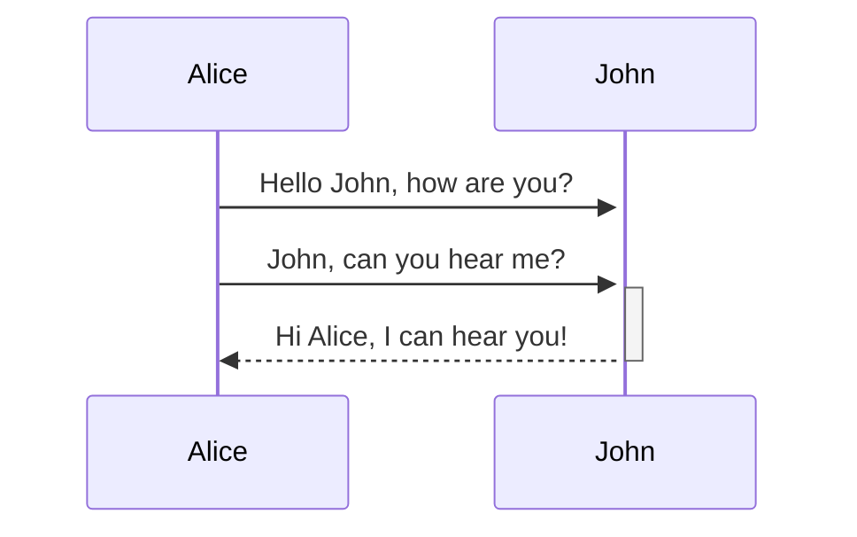
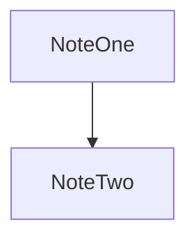

[[Markdown]] is a [[Markup Language|markup language]] for formatting text [^1] and the primary [[File Format|file format]] for [[Obsidian Note|obsidian notes]]. Use this note to test various you can style your notes. 

---
# This is a heading 1

## This is a heading 2

### This is a heading 3

#### This is a heading 4

##### This is a heading 5

###### This is a heading 6

This is a paragraph of text. 

This is a second paragraph of text. Note that blank spaces and newlines are collapsed into a single one. To add multiple use `&nbsp;` (blank space) or `<br>` (newline) in your text. This has backlashes `\` to escape the asterisks \*\*Bold\*\* This text has **Bold**, *Italic*, ~~Strike~~, ==Highlight==. This text has **Bold with _nested_ Italics** and ***Bold with Italics***. A note **tag** is a case-insensitive keyword or topic that helps to categorize notes. Create them using a hash symbol as `#meeting`. Note that tags can be added using the [[Obsidian Note Properties|note's properties]]. To create nested tags use slashes as `#inbox/to-read`.  This is a tag #FirstTag  and another tag #SecondTag

This [[example note|link is internal]] using wikilink format. This [link is internal](example%20note.md) using Markdown format. This [link is external](http://www.example.com) using brackets and parentheses. This [link is external](obsidian://open?vault=MainVault&file=Note.md) and points to a file in another vault. Escape spaces in links using `%20` or by wrapping the URL inside `< >`. Note that block level refs are not part of the standard markdown syntax. ^Link-Syntax-Examples-In-Obsidian

You can have **inline code** `like this` using backticks. To create **code blocks** use triple backticks or 4 spaces (tab): 

```ts
function f<T>(x: T): boolean {
  // Check type and log
  if (typeof x === "string") {
    console.log(`Value: ${x}`); // log string  
  } else {
    let n = 1 + 2 * 3 / 4 - 5; // math ops
    for (let i = 0; i < 2; i++) n += i;
  }
  return !!x; // double negation
}
```

Add a comment with `%% Comment %%`like this: %%This is a markdown comment%%.  Most HTML tags are rendered such as <u>underline</u> or <s>strike</s>, and even comments `<!-- Comment --> `: Use `Alt` to create multiple carets and edit text quickly.

> 
>   This is a **blockquote** with text in bold and in *Italics*
> 

- [x] **Task lists**: This is a completed task.
- [ ] **Task lists**: This is an incomplete task.

- **Unordered lists**, by adding a `-`, `*`, or `+` before the text
    - Second list item
        - Third list item
        - Fourth list item

1. **Ordered lists** , start each line with a number followed by a `.`:
    1. Second list item
        1. Third list item
        2. Fourth list item

All list types can be **nested** and combined:

* First list item
    1. Ordered nested list item
        1. Other
2. Second list item
    - Unordered nested list item
        - Other
            - Other
    - [ ] Task Nested

You can fold headings and indented lists. Add a horizontal line with three or more stars `***`, hyphens `---`, or underscore `___` on the same line. They can even have spaces between them.

This is an external **image**:


Images can be **resized** with the format `[[image]|sizeNumber]`:


If you use an **internal image** you can add custom classes like `center` to the name. Add **math expressions** using MathJax ($2+2=4$) by surrounding it in dollar signs.

$$
\begin{vmatrix}a & b\\
c & d
\end{vmatrix}=ad-bc
$$

Obsidian uses Prism ^[This is an inline footnote!] for **syntax highlighting** of supported languages [^3]. Note that Source and Live mode do not support PrismJS so the highlighting might vary. 

You can add **footnotes** to a paragraph or as inline like in the previous text. Even named footnotes are converted into numbers in reader mode. [^4]

---

Create **tables** using vertical bars and hyphens. The header row must have at least two hyphens per column. First and last vertical bar are optional:

```md
| First name | Last name |
| ---------- | --------- |
| Max        | Planck    |
| Marie      | Curie     |
```

| First name | Last name |
| ---------- | --------- |
| Max        | Planck    |
| Marie      | Curie     |
You can escape `\` the vertical bar for features such as aliases or image resize. Also, you can use colons to define the content alignment:

```md
Left-aligned text | Center-aligned text | Right-aligned text
:-- | :--: | --:
Content | Content | Content
```

| Left-aligned text | Center-aligned text | Right-aligned text |
| :---------------- | :-----------------: | -----------------: |
| Content           |       Content       |            Content |

---

Use Mermaid to add **diagrams** and charts to the note, we recommend using the Mermaid [Live Editor](https://mermaid-js.github.io/mermaid-live-editor) first to design the diagram:



You can add internal links using the `internal-link` class to your node:



Note that internal links on mermaid diagrams are not reflected on the graph view. More info on the [official Mermaid docs](https://mermaid.js.org/intro/).

---

Use **callouts** to add an icon and color to a blockquote. Callouts are defined using type identifiers as `[!type]` (unsupported types default to `note`). The type identifier is case-insensitive.

* List of supported types: abstract (summary, tldr), info, todo, tip (hint, important), success (check, done), question (help, faq), warning (caution, attention), failure (fail, missing), danger (error), bug, example, quote (cite).

Callouts can become foldable by adding a plus (unfolded) or minus(folded) after the type id `[!type]+`:

> [!tip]- Are callouts foldable?
> Yes! In a foldable callout, the contents are hidden when the callout is collapsed.

> [!question] Can callouts be nested?
> > [!todo] Yes!, they can.
> > > [!example]  You can even use multiple layers of nesting.

Create a custom callout with CSS:

```css
.callout[data-callout="custom-question-type"] {
    --callout-color: 0, 0, 0;
    --callout-icon: lucide-alert-circle;
    /* You could also use a custom SVG */
    /*--callout-icon: '<svg>...custom svg...</svg>';*/
}
```

---

You can **embed files**, videos (``), tweets (``) or even entire web pages (`<iframe src="URL"></iframe>`). For PDF's you can even specify a page or size as `![[PDF#page=2#height=400]]`. ^Custom-Block-ID

Make sure embedded files are part of the accepted obsidian file formats: 

1. Markdown files: `md`
2. Image files: `avif`, `bmp`, `gif`, `jpeg`, `jpg`, `png`, `svg`, `webp`
3. Audio files: `flac`, `m4a`, `mp3`, `ogg`, `wav`, `webm`, `3gp`
4. Video files: `mkv`, `mov`, `mp4`, `ogv`, `webm`
5. PDF files: `pdf`

[^1]: Obsidian supports [CommonMark](https://commonmark.org/) and [GitHub Flavored Markdown](https://github.github.com/gfm/).
[^3]: Add 2 spaces at the start of each new line.
    This lets you write footnotes that span multiple lines.
[^4]: Prism [Supported Languages](https://prismjs.com/#supported-languages)

Finally some lorem ipsum generated with: https://jaspervdj.be/lorem-markdownum/
# Lorem Ipsum

## Cornua admovit dicta poterat

Lorem markdownum moribundo. Inamabile seque Aesonis recuset, pasci cista sociis, pastoris et, alto!

> Innocuum reddite tuens incaluit [denique dissuaserat](#una-nec-libasse-terricula) scissaeque male vera umbraeque constitit ut ipsa duro. Manu saxi aures adulterium; tamen ut infernum calido  `syn_bar_port` causam. Amor gramina tubicen *virginis* pendat ora quam. Vota dei Meropisque molibus. Tandemque mite haec procumbere Caenis turba hos tamen clausere illis.

[Silvas namque pinus](#per-mentis-et-teguntur) honores colentibus cibo obliquis nomine sit *positum poscis*. Flectit suam? **Sed tentoria**, petens **exire**, obsessum *nil* iamque finierat terras ne.
## Aquarum est Venerem eductum

Post os et, fortia adfectas cretus. **Di** apta: *est* videt fassusque lilia ignorant concolor tectis tellure secuta corpus clauserat **excipit habet** exsangues Thisbes. Cursus parva quod illa retro simulat toro fratribus *crura*, in corpore vestigia quantam. Cupidine tamen `hdtv_goodput_bar` sera in: gens, sub que Dardanio. Subiectis mundi, nostro `nosql` et calet natarum et prius in.

1. Tenentes caelo
2. Solane aurem esse auras mensura fremit
3. Ducis ruit pertimuit voluptas furta tum dente
## Per mentis et teguntur

Ibimus fatemur sacraque? Quae non recludi desilit temptant optat accedere; non cui Atlas sunt Tethyn gratissima coniunx, simulat. Senesque fraude, nupta corporis hinc debueram. Cum tu equos Prospicientis ictus progenuit Alpheias haec nec Romam! Sceleratum una abest de Peneos eundem [manus](#aquarum-est-venerem-eductum) at male vestibus et tacito furoris quoque errore, via [isset](#cornua-admovit-dicta-poterat).

```c
#include <stdio.h>
#define CONCAT(a,b) a##b
typedef union {
    uint32_t u32;
    uint8_t bytes[4];
} Word;
typedef struct {
    unsigned a:3;
    unsigned b:5;
    Word w;
    struct Node *next;
} Node;
typedef void (*callback_t)(int,int*);
inline int tricky(int x) { return x ^ (x<<2) | (x>>1); }
void operateArray(int *arr, size_t n, callback_t cb) {
    FOREACH(i,n) cb(i,&arr[i]);
}
GEN_FUNC(test)
int main(void) {
    Node *head = malloc(sizeof(Node));
    if(!head) return EXIT_FAILURE;
    head->a = 5; head->b = 17; head->next = NULL;
    head->w.u32 = 0xDEADBEEF;
    int arr[6] = {1,2,3,4,5,6};
    operateArray(arr, 6, test_func);
    printf("Bitfield a=%u b=%u w=0x%X\n", head->a, head->b, head->w.u32);
    const char *msg = MULTI_LINE_STR;
    puts(msg);
    int result;
    asm("movl $42, %0" : "=r"(result));
    printf("Inline asm result=%d\n", result);
    free(head);
    return 0;
}
```

| Short | Medium Text                                                                                                                                                                                                                                                                                                                                                                                 | Very Long Text That Should Stress The Layout And Potentially Cause Horizontal Scroll Or Wrapping Issues If The Container Is Not Wide Enough                                                                                             |
| ----- | ------------------------------------------------------------------------------------------------------------------------------------------------------------------------------------------------------------------------------------------------------------------------------------------------------------------------------------------------------------------------------------------- | --------------------------------------------------------------------------------------------------------------------------------------------------------------------------------------------------------------------------------------- |
| A     | BLorem ipsum dolor sit amet, consectetur adipiscing elit, sed do eiusmod tempor incididunt ut labore et dolore magna aliqua.BLorem ipsum dolor sit amet, consectetur adipiscing elit, sed do eiusmod tempor incididunt ut labore et dolore magna aliqua.Example Lorem ipsum dolor sit amet, consectetur adipiscing elit, sed do eiusmod tempor incididunt ut labore et dolore magna aliqua. | Lorem ipsum dolor sit amet, consectetur adipiscing elit, sed do eiusmod tempor incididunt ut labore et dolore magna aliqua. Ut enim ad minim veniam, quis nostrud exercitation ullamco laboris nisi ut aliquip ex ea commodo consequat. |
|       | Test                                                                                                                                                                                                                                                                                                                                                                                        | This is another extremely long string meant to push the layout limits of any table container, including nested divs, CSS flexboxes, or responsive designs.                                                                              |
| C     | Short                                                                                                                                                                                                                                                                                                                                                                                       | Supercalifragilisticexpialidocious even though the sound of it is something quite atrocious, this long single word tests overflow handling.                                                                                             |
| D     | Medium                                                                                                                                                                                                                                                                                                                                                                                      | Here is a sentence that goes on and on and might even contain punctuation, numbers 1234567890, and symbols !@#$%^&*() to further stress text rendering.                                                                                 |
| E     | Tiny                                                                                                                                                                                                                                                                                                                                                                                        | A very long paragraph that repeats: Lorem ipsum dolor sit amet, consectetur adipiscing elit. Lorem ipsum dolor sit amet, consectetur adipiscing elit. Lorem ipsum dolor sit amet, consectetur adipiscing elit.                          |
